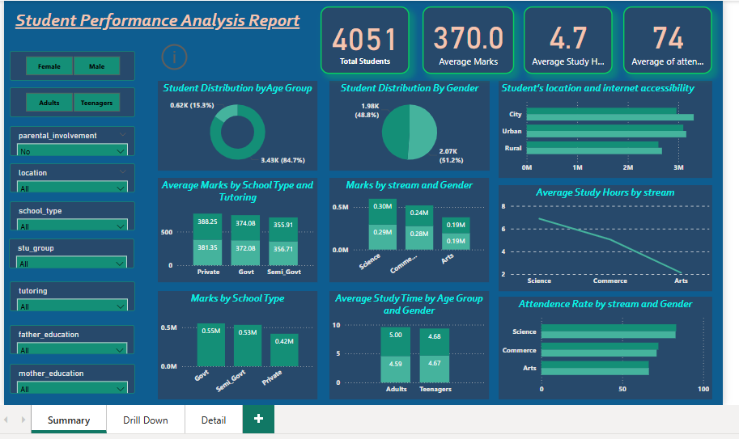
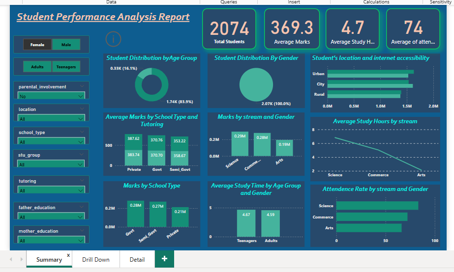
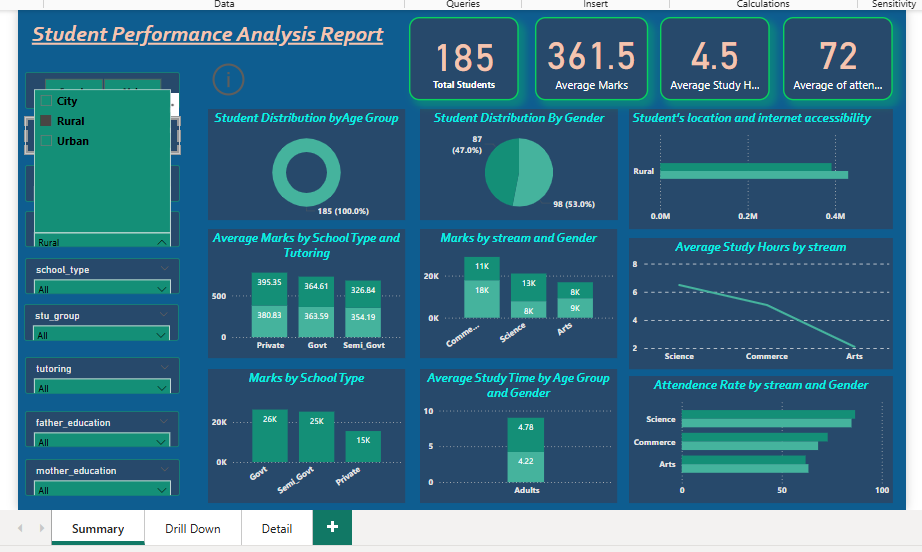
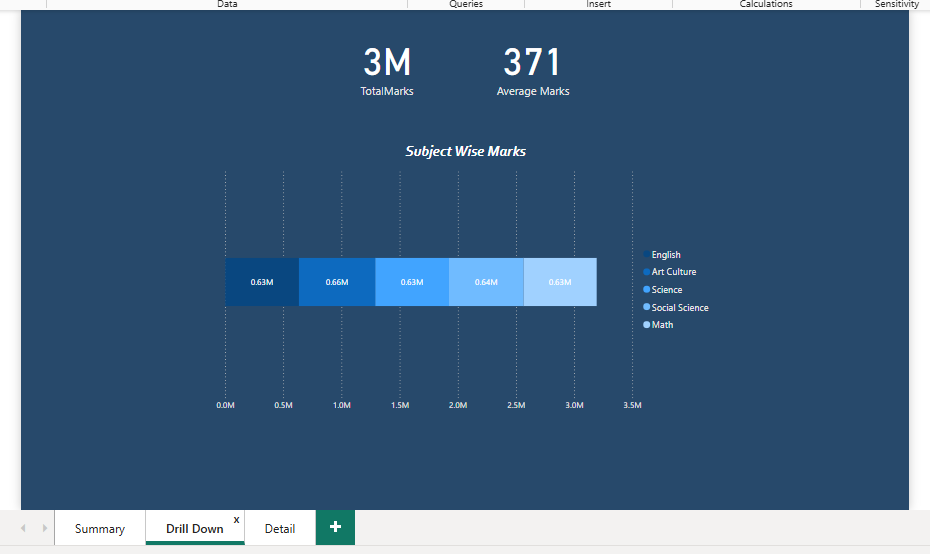
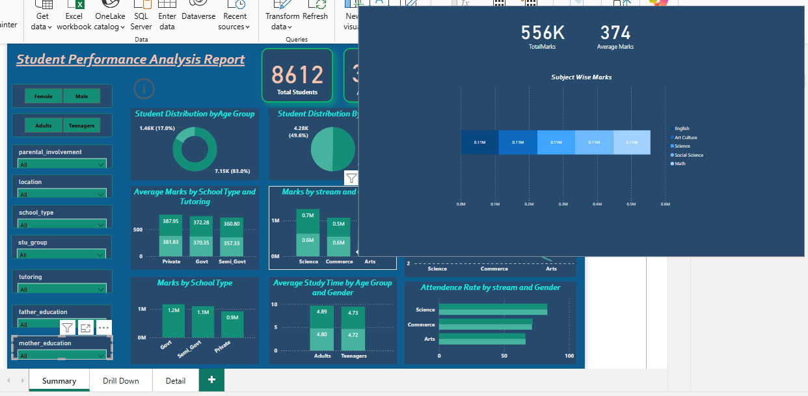
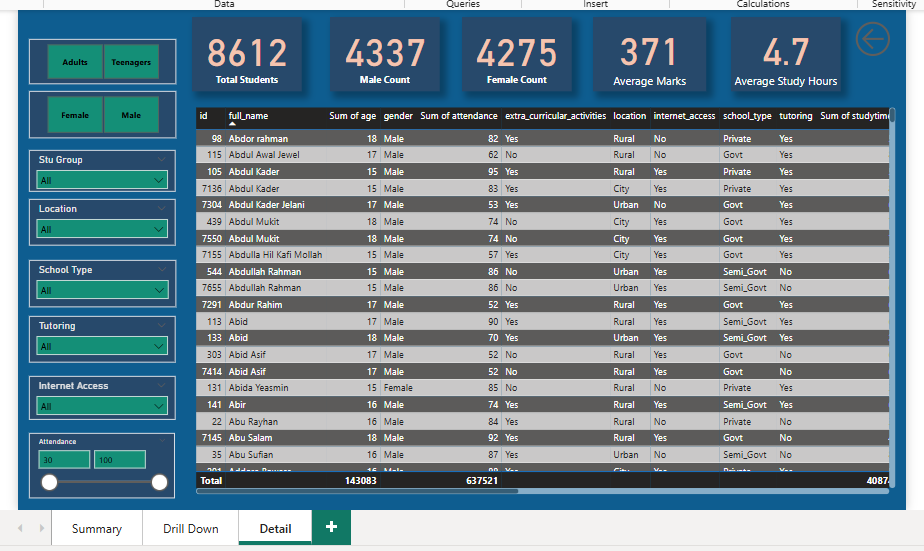
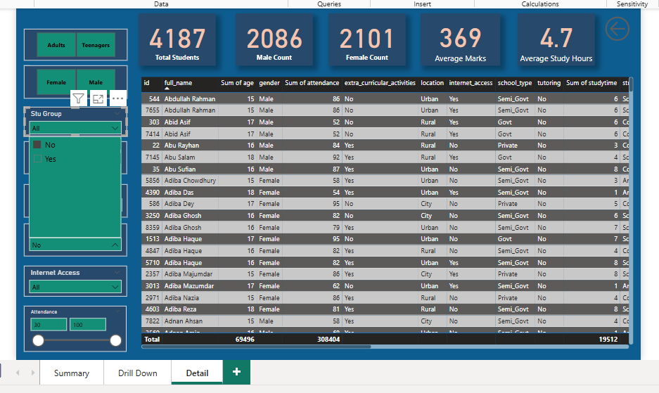

# 🎓 Student Performance Dashboard (Power BI)

This project presents a fully interactive Power BI dashboard built on a dataset that tracks students' academic performance. The analysis dives into how **demographic and educational factors** impact scores in Math, Reading, and Writing.

---

## 🎯 Objectives

- Explore the influence of **gender**, **parental education**, **lunch type**, and **test preparation** on students’ academic performance.
- Build a clear and interactive **Power BI dashboard** to visualize key patterns.
- Derive actionable **insights** to better understand the education landscape.

---

## ⚙️ Data Preparation

### 🧼 Data Cleaning
- Removed top two null rows
- Renamed column headers
- Verified and corrected data types for consistency

### 🔄 Data Transformation
- Deleted irrelevant columns: `Mother Job`, `Father Job`, `Guardian`
- Created custom columns:
  - `Total Marks`
  - `Student Group` (categorization by performance)

### 📈 Data Enrichment (Measures)
- Added DAX measures for:
  - `Average Study Hours`
  - `Average Attendance`
  - `Female Count` and `Male Count`
  - `Average Marks`

---

## 📊 Dashboard Overview

The dashboard consists of **two interactive pages**:

### 🧾 1. Summary Page



A high-level overview with interactive KPIs, charts, filters, and navigation buttons.

#### 🟢 KPIs
- Total Students  
- Average Marks  
- Average Study Hours  
- Average Attendance

#### 🎛️ Slicers / Interactive Buttons
Users can filter data by:
- Gender
- Age Group
- Parental Involvement
- Location
- School Type
- Student Group
- Tutoring
- Father’s Education
- Mother’s Education





#### 📊 Charts & Visuals
1. **Donut Chart** – Student distribution by age group  
2. **Pie Chart** – Gender distribution  
3. **Stacked Bar Chart** – Average marks by school type and tutoring  
4. **Stacked Bar Chart** – Marks by school type with drill-through  
5. **Stacked Bar Chart** – Marks by stream and gender  
6. **Bar Chart** – Average study time by age group and gender  
7. **Clustered Bar Chart** – Student location vs internet access  
8. **Line Chart** – Average study hours by stream  
9. **Clustered Bar Chart** – Attendance rate by stream and gender  

#### 🔍 Drill-Through Functionality
From "Marks by School Type" and "Marks by Stream and Gender" charts, users can drill through to view:
- Total Marks
- Average Marks
- Subject-wise Marks






#### 🔁 Page Navigation
- **Info Button** on the Summary Page → Navigates to Detail Page
- **Back Button** on the Detail Page → Returns to Summary Page

---

### 📋 2. Detail Page




A student-level data breakdown with interactive filters and detailed records.

#### 📌 Cards
- Total Students  
- Male Count  
- Female Count  
- Average Marks  
- Average Study Hours

#### 🎛️ Slicers / Filters
Filter by:
- Gender
- Age Group
- Student Group
- Location
- School Type
- Tutoring
- Internet Access
- Attendance



---

## 📊 Dashboard Features

- **Interactive filters** for gender, parental education, lunch type.
- **Dynamic KPIs**: Average scores in Math, Reading, and Writing.
- **Visuals**:
  - Bar chart of test scores by gender and education.
  - Pie chart of performance levels.
  - Line/clustered visuals showing distribution and trends.

---

## 🔑 Key Insights

- **Test preparation** has a clear positive impact on performance.
- **Female students** excel in reading and writing; **males** slightly outperform in math.
- **Higher parental education** is associated with better scores.

---

## ✅ Conclusion

This dashboard provides a powerful view into the factors influencing student performance. By making the data interactive and visual, we can draw useful conclusions that may help educators, analysts, or policymakers make informed decisions about educational interventions and support strategies.

---

## 🚀 How to Use

1. Clone this repo or download the files.
2. Open `students-performance.pbix` in **Power BI Desktop**.
3. Explore the slicers, charts, and KPIs for insights!

---

## 📁 Project Structure

```
├── students-performance.pbix        # Power BI dashboard
├── Data
│   └── students-dataset.csv         # Cleaned dataset
│
└── images
    └── dashboard-preview.png        # Screenshot of the dashboard
```

---


## 🛠 Tools Used

- **Power BI Desktop** – for data modeling and interactive dashboard creation  
- **Power Query** – for data transformation and cleaning

---

## 👤 Author

**IqraIzhar**
- **LinkedIn:** [linkedin.com/in/iqra-izhar-08b8b8330](https://www.linkedin.com/in/iqra-izhar-08b8b8330)  
- **GitHub:** [github.com/iqraizhar72](https://github.com/iqraizhar72)
- **Email:** [iqraizhar72@gmail.com](mailto:iqraizhar72@gmail.com)

## 🌟 Feedback & Support

Feel free to share suggestions or compliments — your feedback is appreciated!  
If you found this project useful, please consider giving it a ⭐️.
